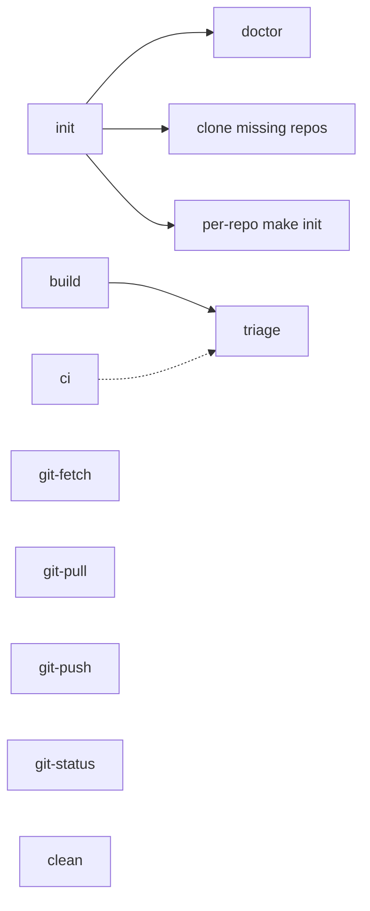

# Makefile Reference

The [`Makefile`](./Makefile) is the single source of truth for orchestrating the
triage multi-repo estate. It reads [`repos.mk`](./repos.mk) as its manifest and
fans commands out across the child repos. Run `make help` for the quick target
list; this file is the narrative reference.

The workspace is optional. Every child repo is fully usable on its own — nothing
in a child repo depends on this workspace. The Makefile only adds cross-repo
convenience.

## Target overview

Solid arrows = hard prerequisite (dependency order). Dotted arrows = dumb
pass-through (each repo's gate runs independently; no ordering assumed).

## Targets

### Develop

| Target | Description |
|--------|-------------|
| `help` | List targets (the default goal) |
| `init` | Clone missing repos, run per-repo `make init`, then `make doctor` |
| `doctor` | Repo roster (present/missing) + delegate `make doctor` to each child repo |
| `build` | Fan-out `make build` in dependency order |
| `ci` | Dumb pass-through: `make ci` in every repo that has a Makefile |
| `pre-commit` | Dumb pass-through: `make pre-commit` in every repo that has a Makefile |
| `clean` | Fan-out `make clean` to repos that define the target |

### Git

| Target | Description |
|--------|-------------|
| `git-status` | `git status -s` across workspace + all checked-out repos |
| `git-fetch` | `git fetch --all --prune` across workspace + all checked-out repos |
| `git-pull` | `git pull --ff-only` across workspace + repos; skips dirty or diverged |
| `git-push` | `git push` across workspace + repos; warns on failure |

### GitHub

| Target | Description |
|--------|-------------|
| `gh-runs-list` | List in-flight Actions runs across repos in `REPOS_GH` |
| `gh-runs-watch` | Watch in-flight Actions runs across repos in `REPOS_GH` |
| `gh-runs-status` | Last completed run per workflow across repos in `REPOS_GH` |

Each `gh-runs-*` target delegates to the child repo's own target with
`$(MAKE) --no-print-directory -C <repo> ... || true` — one repo's failure
(e.g. `gh` auth) never aborts the sweep. `GH_LIMIT` (default 50) caps how
many recent runs are fetched per repo.

## `make init` — idempotent bootstrap

`make init` is safe to re-run at any time. For each repo in [`repos.mk`](./repos.mk):

1. If the directory has a `.git` and the remote origin matches the manifest URL:
   already present — skipped.
2. If the directory has a `.git` but the origin doesn't match: warns and skips
   (never clobbers an existing checkout).
3. If the directory doesn't exist: `git clone --branch <default-branch> <url>`.

After cloning, it runs `make init` in each repo listed in `REPOS_MAKE_INIT`:

| Repo | `make init` runs? | Notes |
|------|-------------------|-------|
| `triage` | yes | `go mod download` |
| `triage-action` | yes (when added) | future m6 repo |
| `triage-secrets` | yes (when added) | future plugin repo |

Finally it calls `make doctor` to surface any missing system tools.

## `make doctor` — roster check + per-repo tool health

Read-only; installs nothing. Accepts `MODE=default|release` (default: `default`).

**Repo roster** (workspace-owned): for each repo in `repos.mk`, checks whether
the directory exists, is a git repo, and its `origin` matches the manifest URL.
A missing repo or origin mismatch contributes to a non-zero exit.

**Per-repo tool check** (delegated): runs `make doctor MODE=$(MODE)` in each
repo listed in `REPOS_MAKE_CI`. Each child repo owns its own tool checks via
its `triage.yaml` and the `make doctor` dogfood target.

| Repo | Pin file | Tools checked (default mode) |
|------|----------|------------------------------|
| `triage` | `.go-version` | git, gh, go, golangci-lint |

`make doctor MODE=release` adds release-time tools (goreleaser, etc.) — see
`triage/Makefile` and `triage/triage.yaml` for what the `release` profile checks.

## `make build` — dependency-ordered fan-out

Runs `make build` in the order defined by `REPOS_BUILD_ORDER` in `repos.mk`:

1. `triage` — compiles the `triage` Go binary into `triage/bin/`.

Other repos (`triage-action`, `triage-secrets`) have no build step; they
participate only in `make ci`.

If any step fails, `make build` stops immediately (`set -euo pipefail`).

## `make ci` and `make pre-commit` — dumb pass-through

These are **not** a cross-repo gate in the traditional sense. They simply
invoke `make ci` (or `make pre-commit`) in each checked-out repo that has a
Makefile, in an unspecified order. Each repo's gate runs exactly as that repo
defines it:

| Repo | `make ci` runs |
|------|----------------|
| `triage` | `build` + `lint` + `test` |
| `triage-action` | `lint` (actionlint + shellcheck) + smoke test (when added) |

If one repo fails, the remaining repos still run, and the workspace target
exits non-zero at the end. This surfaces all failures at once rather than
stopping at the first.

## `make git-fetch`, `make git-pull`, and `make git-push`

`git-fetch` is observe-only: it updates remote-tracking refs in every repo
but never modifies working trees or branches. Safe on dirty, feature, detached,
or worktree repos.

`git-pull` runs `git pull --ff-only`. Repos with dirty working trees or that
cannot fast-forward are warned and skipped — a mass pull can never create
surprise merge commits or stomp local work.

`git-push` runs `git push` on the workspace and each checked-out repo.
Any repo where the push fails (no upstream configured, rejected, or already
up-to-date) emits a warning and continues — a failed push in one repo never
aborts the rest.

## `repos.mk` — the manifest

[`repos.mk`](./repos.mk) is the machine source of truth. All workspace targets
derive their repo list from the variables defined there. To add a repo, uncomment
its entry in `repos.mk` and keep the list variables consistent
(`REPOS`, `REPOS_MAKE_INIT`, `REPOS_BUILD_ORDER`, `REPOS_MAKE_CI`,
`REPOS_MAKE_CLEAN`, `REPOS_FOLLOW_ONLY`, `REPOS_GH`).

| Variable | Purpose |
|----------|---------|
| `REPOS` | All repo directory names (as cloned) |
| `REPO_URL.<dir>` | Expected `origin` URL for roster checks and clone |
| `REPO_BRANCH.<dir>` | Default branch for `git clone --branch` |
| `REPOS_MAKE_INIT` | Repos whose `make init` the workspace invokes |
| `REPOS_BUILD_ORDER` | Strict dependency order for `make build` |
| `REPOS_MAKE_CI` | Repos in `make ci` / `make pre-commit` pass-through |
| `REPOS_MAKE_CLEAN` | Repos that define `make clean` |
| `REPOS_FOLLOW_ONLY` | Generated mirrors; skipped on push (none today) |
| `REPOS_GH` | Repos with Actions workflows (`gh-runs-*` delegation) |

## Worktree convention

Worktrees for child repos land as **siblings** of the main checkout inside
this workspace root — e.g. `triage/` on branch `feat/foo` has its worktree
at `triage-foo/`. The allowlist `.gitignore` (`/*` then selective un-ignores)
covers all worktrees automatically without needing to list them.

See [CONTRIBUTING.md](./CONTRIBUTING.md) for the full worktree naming convention.
